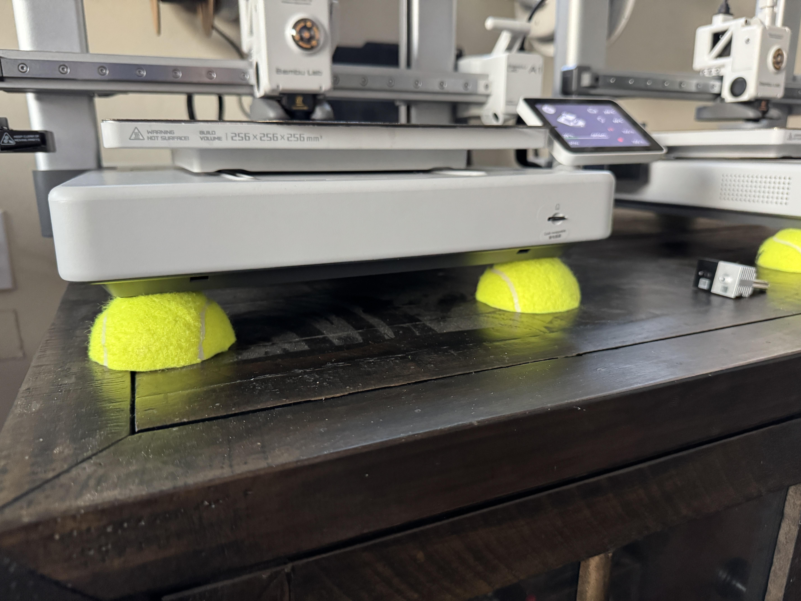

## [Simrig Isolators](/projects/simrig-isolators)

Enhance your simrig by isolating it from the floor [more...](/projects/simrig-isolators)

<a href="https://s16nengineering.etsy.com"><button>BUY</button></a>

{: .center-image .small-image }

## [Funky-coder](/projects/funky-coder)

VR focused input device for flight and racing [more...](/projects/funky-coder)

<a href="https://s16nengineering.etsy.com"><button>BUY</button></a>

{: .center-image .small-image }

## [Funky-coder Plus](/projects/funky-coder-plus)

Funky-coder with a mode switch [more...](/projects/funky-coder-plus)

<a href="https://s16nengineering.etsy.com"><button>BUY</button></a>

{: .center-image .small-image }

## [3D Printer Vibration Isolation](/projects/3d-printer-balls)

Low-cost/free and effective [more...](/projects/3d-printer-balls)

{: .center-image .small-image }

## [Archive](/projects/old/index )
