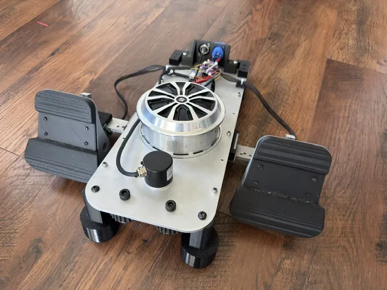
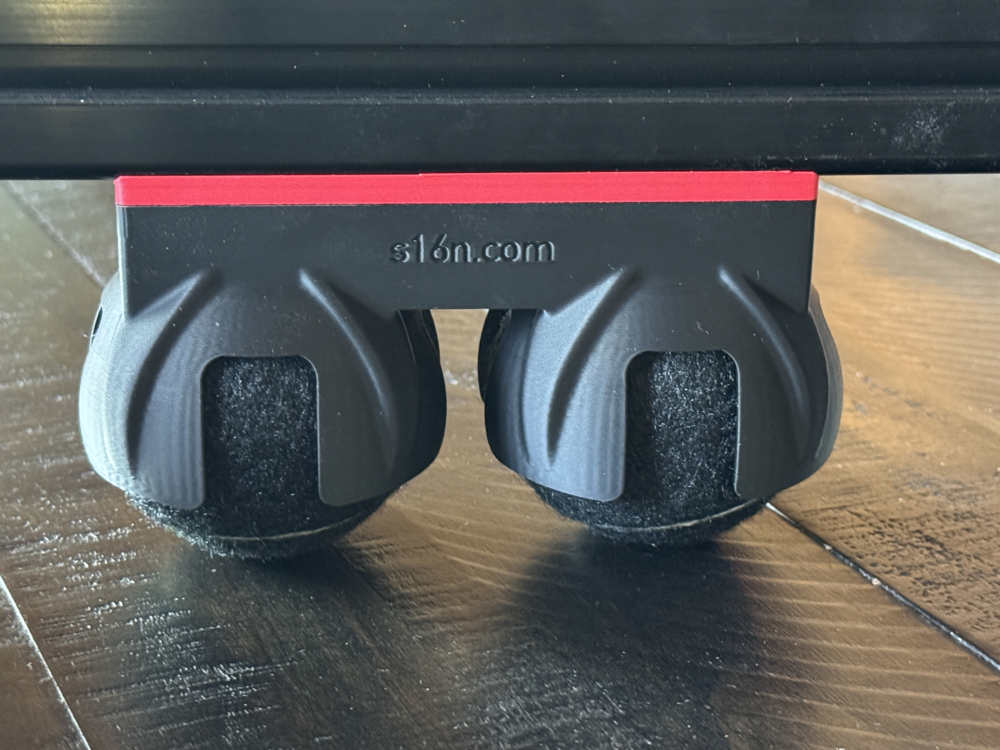
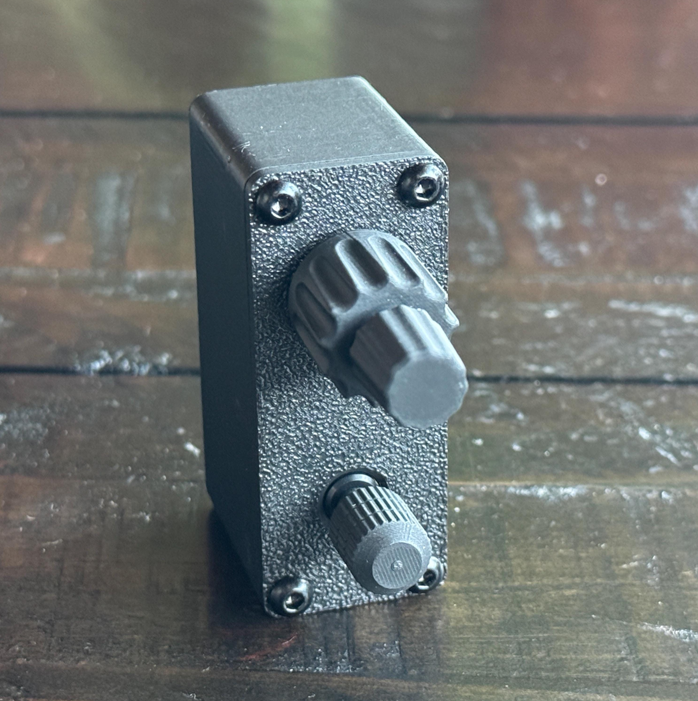
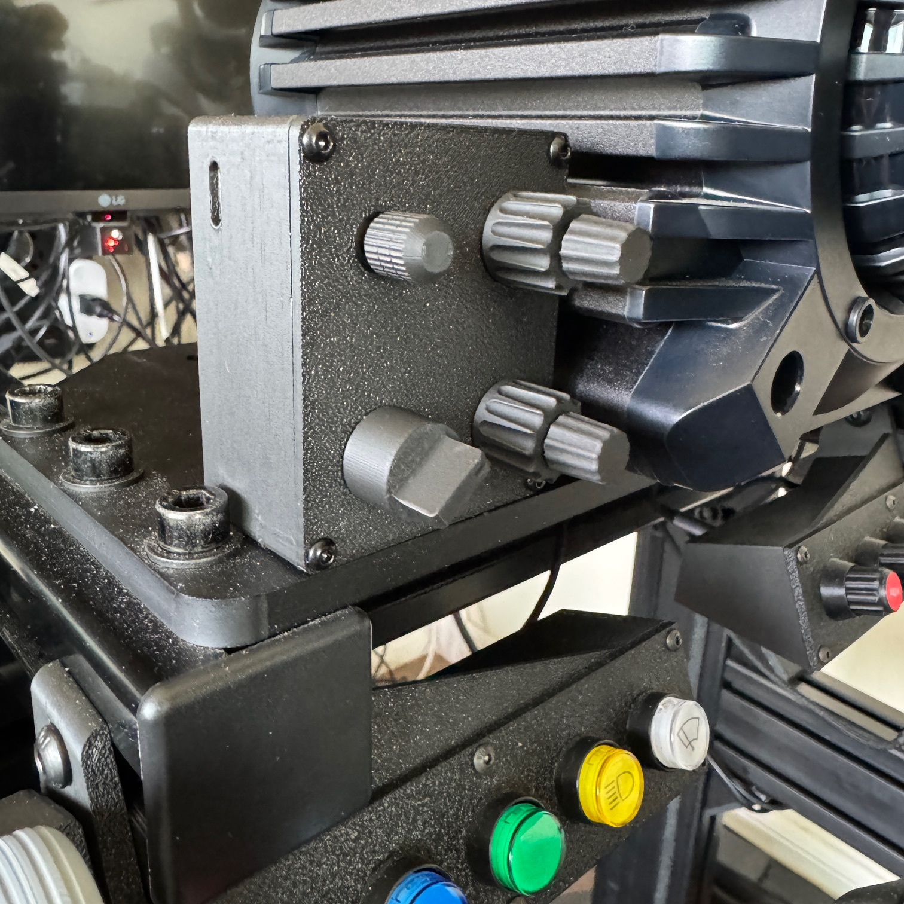

## [GA block](/projects/ga-block)

My daily GA flyer. 

{: .center-image .small-image }

## [Custom P51D block](/projects/p51d-block)

A remix for a specific requirement

{: .center-image .small-image }

## [Force Feedback Rudder Pedals](/projects/ffb-rudder-pedals)

With loadcell toe brakes.

{: .center-image .small-image }

## [Simrig Isolators](/projects/simrig-isolators)

Enhance your simrig by isolating it from the floor [more...](/projects/simrig-isolators)

<a href="https://s16nengineering.etsy.com"><button>BUY</button></a>

{: .center-image .small-image }

## [Funky-coder](/projects/funky-coder)

VR focused input device for flight and racing [more...](/projects/funky-coder)

<a href="https://s16nengineering.etsy.com"><button>BUY</button></a>

{: .center-image .small-image }

## [Funky-coder Plus](/projects/funky-coder-plus)

Funky-coder with a mode switch [more...](/projects/funky-coder-plus)

<a href="https://s16nengineering.etsy.com"><button>BUY</button></a>

{: .center-image .small-image }

## [Archive](projects/archive/index)
