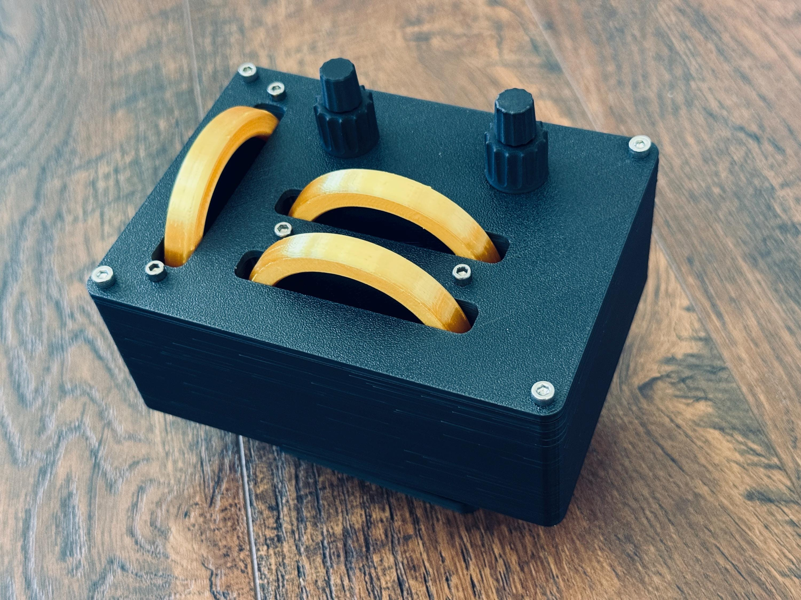
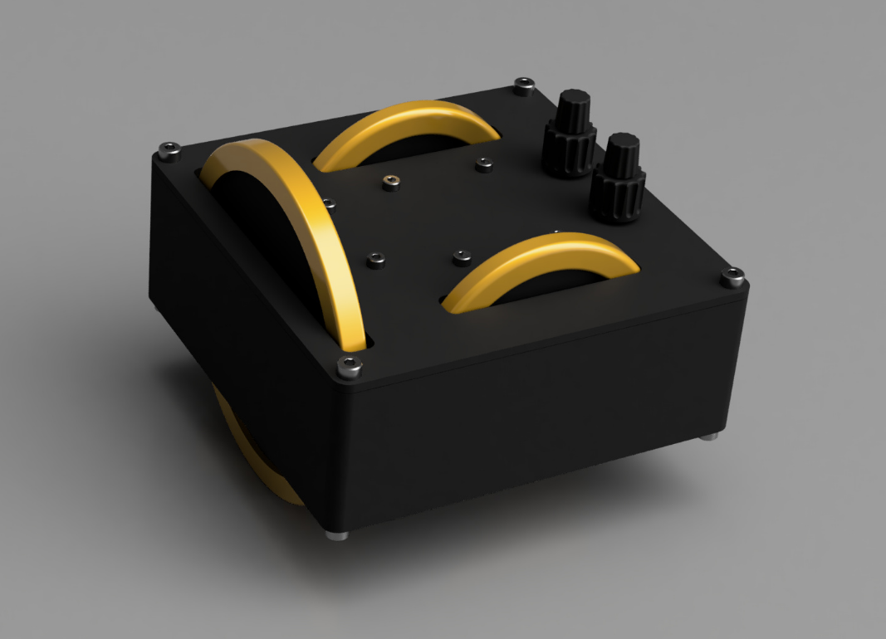
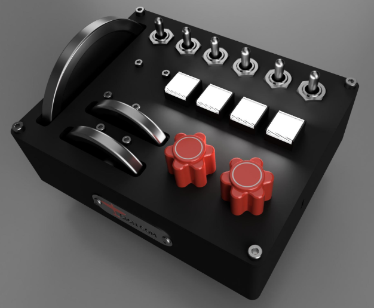
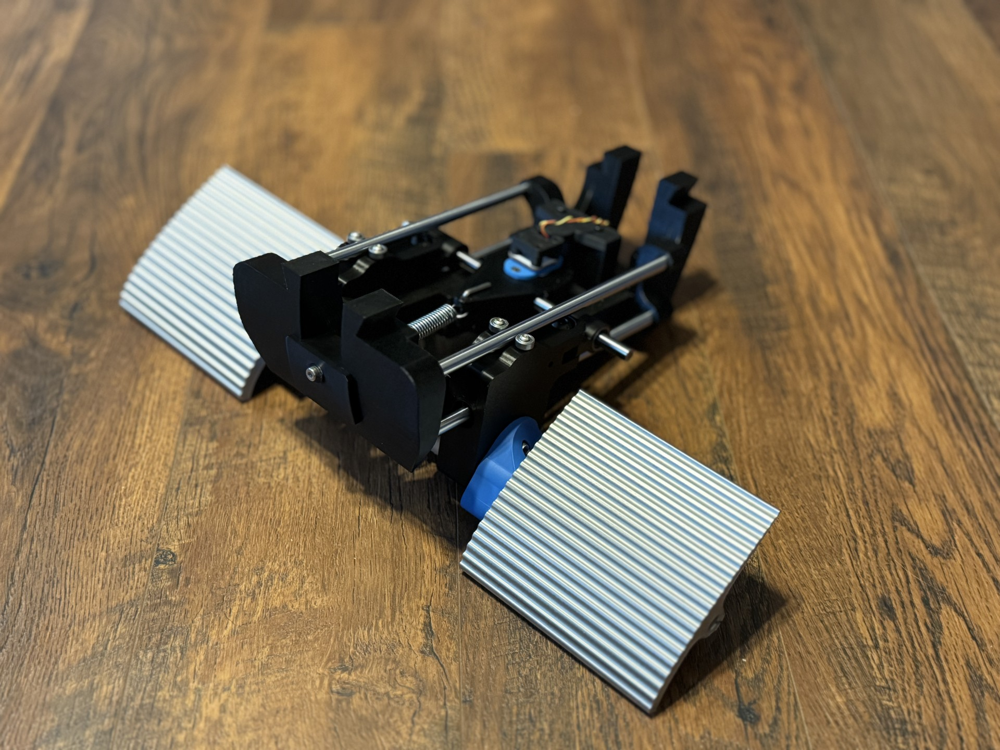
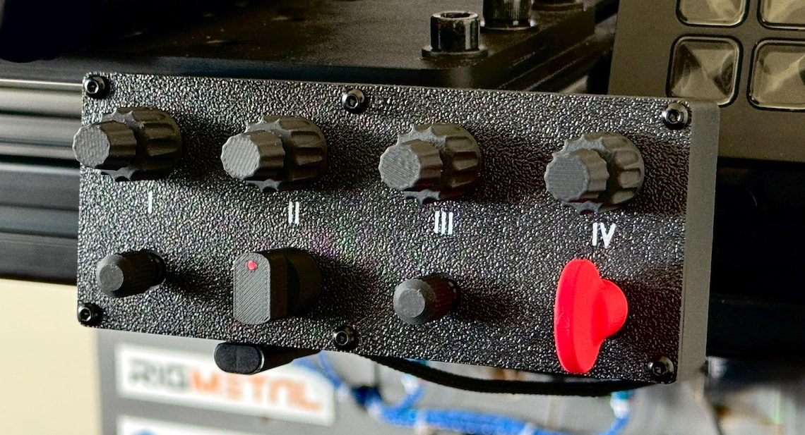
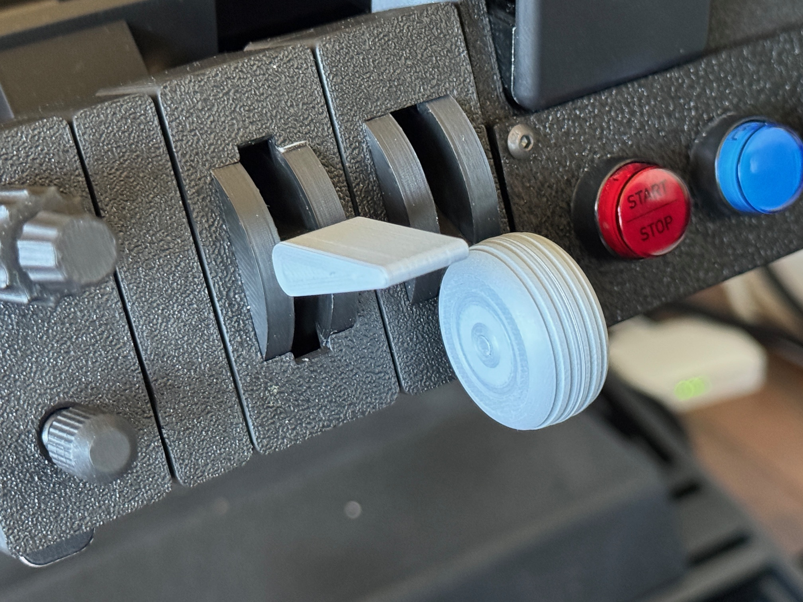
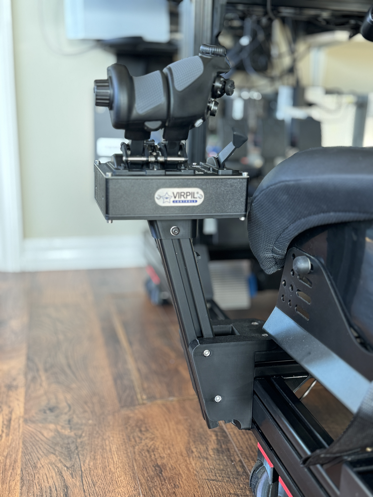
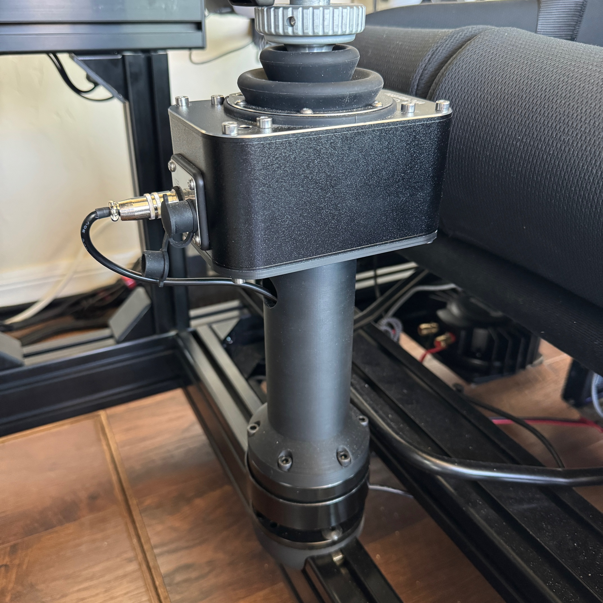
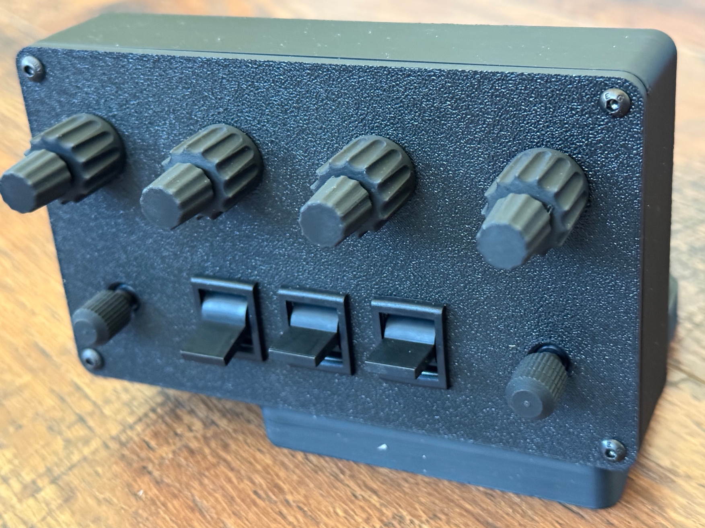

```
title: Archive
```

## [Trim Deck Mini](/projects/archive/trim-deck-mini)

Trim controls for flight sim [more...](/projects/archive/trim-deck)

<a href="https://s16nengineering.etsy.com"><button>BUY</button></a>

{: .center-image .small-image }

## [Trim Deck](/projects/archive/trim-deck)

Trim controls for flight sim [more...](/projects/archive/trim-deck)

<a href="https://s16nengineering.etsy.com"><button>BUY</button></a>

{: .center-image .small-image }

## [Trim Deck OG](/projects/archive/trim-deck-og)  

Trim controls for flight sim [more...](/projects/archive/trim-deck)

{: .center-image .small-image }

## [Rudder Pedals](/projects/archive/rudder-pedals)

Rudder pedals with toe brakes for dual use rigs [more...](/projects/archive/rudder-pedals)

{: .center-image .small-image }

## [Funky-coder Quattro](projects/archive/funky-coder-quattro)

{: .center-image .small-image }


## [Trimbox](/projects/archive/trimbox)

Input device for aircraft trimmables [more...](/projects/archive/trimbox)

{: .center-image .small-image }

## [Mini Flight Controls](/projects/archive/mini-flight-controls)

Flaps and landing gear + a funky-coder all in one [more...](/projects/archive/mini-flight-controls)

{: .center-image .small-image }

## [Virpil CDT-VMAX rig bracket](/projects/archive/virpil-cdt-vmax-bracket-v2)

Bracket to mount Virpil CDT-VMAX to a simrig  [more...](/projects/archive/virpil-cdt-vmax-bracket-v2)

{: .center-image .small-image }

## [Virpil Quick Release](/projects/archive/warbrd-qr)

Quick release for Virpil WarBRD [more...](/projects/archive/warbrd-qr)

{: .center-image .small-image }

## [Encoder Box](/projects/archive/encoder-box)

Multiple encoders HID device [more...](/projects/archive/encoder-box)

{: .center-image .small-image }

## [Hookster](https://github.com/stuart11n/Hookster)

A kitchen sink SimHub plug-in with webhooks and [more...](https://github.com/stuart11n/Hookster)

{: .center-image .small-image }