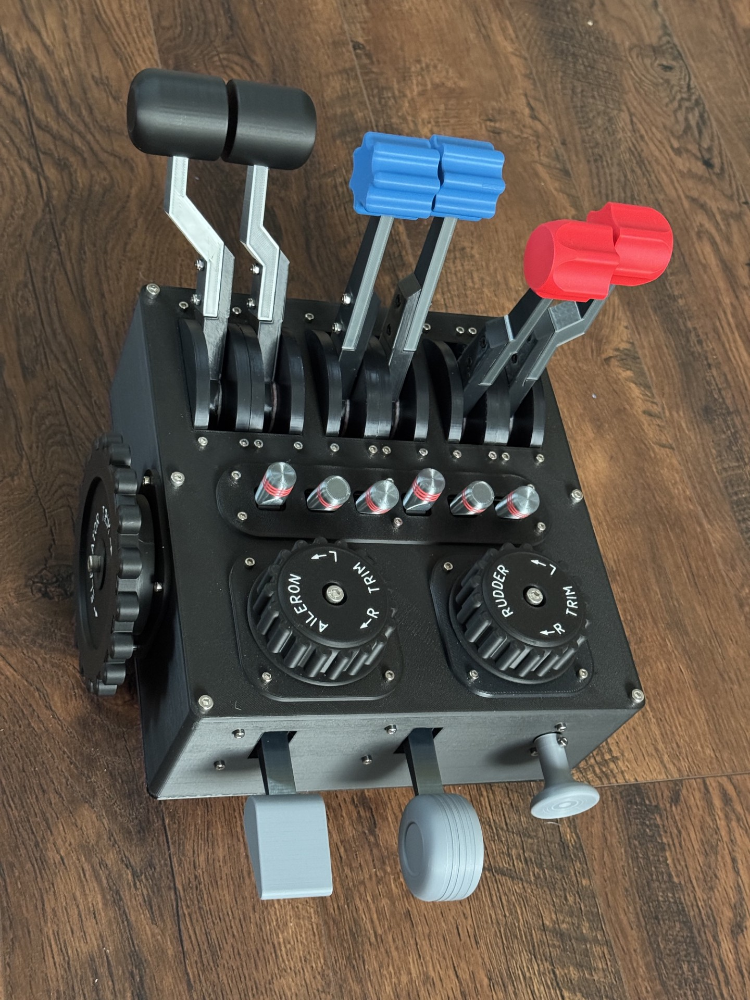
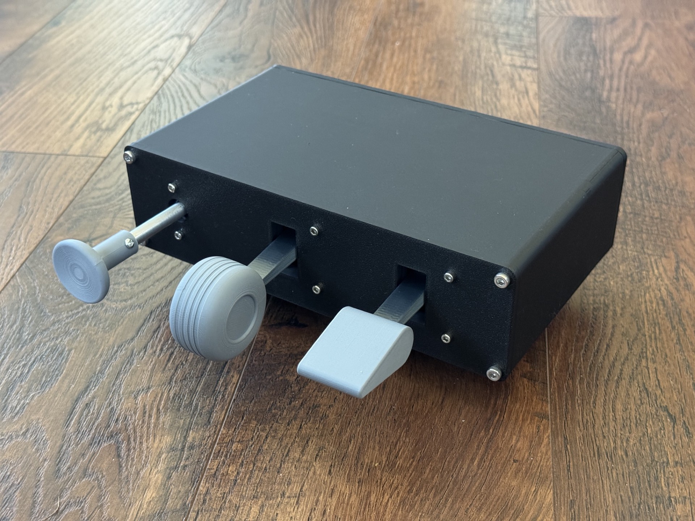

## GA Block

I couldn't find anything commercially available that did what I wanted or didn't feel cheap. So I made this. It is attached to the side of my rig.

* 9 axis, all magnetic sensors 
* real mechanical friction on all the trim dials and stick controls
* switches for turbine/prop control
* finger lifters coming, detents and mechanism bolts on

For ergonomic reasons I moved the flaps, landing gear and parking brake into a separate unit. The parking brake has hydraulic damping. 

