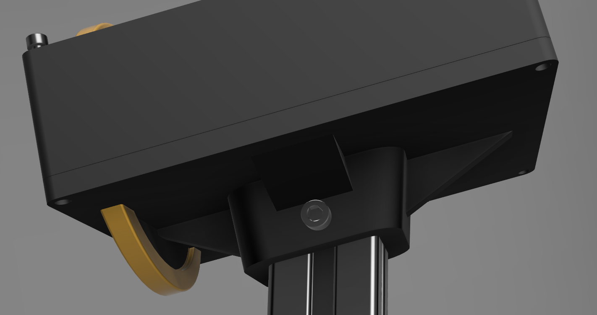

<a href="https://s16nengineering.etsy.com"><button>BUY</button></a>

Trim Deck Lite is a set of trim wheels for elevator, aileron, rudder plus three buttons for controlling trim reset, auto-trim or something else. Each wheel has a friction damper; they will not freewheel or move of their own free-will.

This is a video of the **full** Trim Deck:

<iframe width="560" height="315" src="https://www.youtube.com/embed/a8p1j_3Wt-U?si=X5OfM-vOUT1BMG70" title="YouTube video player" frameborder="0" allow="accelerometer; autoplay; clipboard-write; encrypted-media; gyroscope; picture-in-picture; web-share" referrerpolicy="strict-origin-when-cross-origin" allowfullscreen></iframe>

# Trim Wheels

The elevator is 110mm in diameter, the rudder and aileron are 80mm in diameters. They all use a optical encoders producing 100 pulses per revolution. This provides a very smooth motion. 

The wheels protrude from the bottom of the case.

{: .center-image }

# Push Buttons

{: .center-image .small }

Three general purpose momentary push buttons, single color and constantly illuminated.  

# Software

SPAD.next is required to alter the speed of trim adjustment. This is certainly true for MSFS if you want the rotation of the wheels to match in-game speed (as show in the video).

The wheel emits 100 events per rotation.  Other software (e.g. Mobiflight, Axis and Ohs) that allows mapping of device events to SIMCONNECT data values should also work and games that have built-in functionality to make external trim wheels work effectively should too.  **As I haven't personally tested these alternatives I cannot attest to their effectiveness.**

These table shows the SIMCONNECT events and values I use in SPAD.next. 

## Trim

The size of the increment/decrement can be adjusted to taste and/or to aircraft. Some aircraft have built-in trim sensitivity adjustments that may also be helpful.

| Trim Wheel | SIMCONNECT data value  | Increment/Decrement by |
| ---------- | ---------------------- | ---------------------- |
| Elevator   | ELEVATOR TRIM POSITION | 0.001                  |
| Aileron    | AILERON TRIM PCT       | 0.025                  |
| Rudder     | RUDDER TRIM PCT        | 0.025                  |

### Black Square Starship

The Starship seems to work better with a larger increment of 0.005

# Mounting

The size of the elevator wheel does make mounting slightly challenging. The housing is 136x51x170mm, the elevator wheel protrudes 30mm. 

There are four mounting options:

An adapter that fixes directly onto my [mounting bracket](./virpil-cdt-vmax-bracket-v2),

A base with 1/4" screw socket for 1/4" desk clamp (not included) and 4 x m3 hardpoints for your own mounting options

Flat bottom

# Photos

close-up of customer build Trim Deck with black/gold colorway. Custom colors available.

