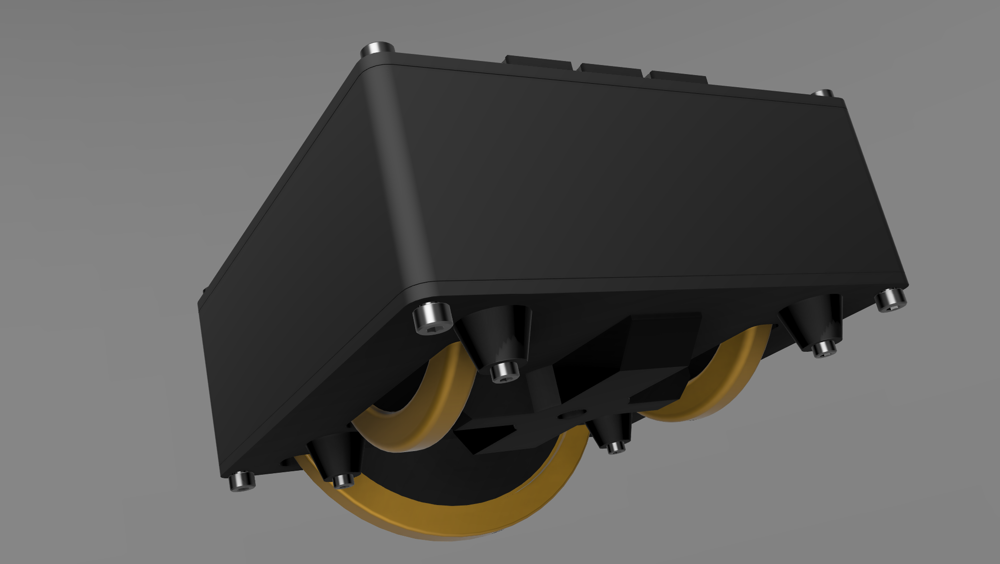

<a href="https://s16nengineering.etsy.com"><button>BUY</button></a>

Trim Deck Lite is a set of trim wheels for elevator, aileron, rudder plus three buttons for controlling trim reset, auto-trim or something else. Each wheel has a friction damper; they will not freewheel or move of their own free-will.

This is a video of the **full** Trim Deck:

<iframe width="560" height="315" src="https://www.youtube.com/embed/a8p1j_3Wt-U?si=X5OfM-vOUT1BMG70" title="YouTube video player" frameborder="0" allow="accelerometer; autoplay; clipboard-write; encrypted-media; gyroscope; picture-in-picture; web-share" referrerpolicy="strict-origin-when-cross-origin" allowfullscreen></iframe>

# Trim Wheels

The elevator is 110mm in diameter, the rudder and aileron are 80mm in diameters. They all use a optical encoders producing 100 pulses per revolution. This provides a very smooth motion. 

The trim wheels emit button presses and are also mapped to axis. 

The wheels protrude from the bottom of the case.

{: .center-image }

# Encoders

Two general purpose dual encoders are available for mapping.

# Mapping

The trim wheels can be mapped using button presses or axis, each has different advantages and disadvantages. Not all games allow mapping all trims to an axis.

### Axis

Mapping using axis is straight forward. The sensitivity can be adjusted directly in the simulation by setting the upper and lower bounds (number of rotations) as you wish. 

The downside is the axis position can become desynchronized from the simulation causing sudden jumps when the axis is moved, either physically or in the simulation. This can happen any time the trim wheel or trim in the simulation are moved independently of each other. For example at the start of a flight there will be mismatch between the physical position and where the simulation thinks the trim wheel is, so the first time you touch the physical wheel the trim will jump to the wheel position. It can also happen if AP adjusts the trim too.

For this reason there is a trim reset button on lower right. Press that button to center all the **physical** trim wheel axis before a flight or any other time.

### Button presses

Mapping with button presses will not desynchronize, the limitation is there are 100 presses per revolution and how the sim interprets each of those presses varies, even between aircraft. MSFS generally doesn't do this well and trim movement will most likely be very slow because it's actually expecting the button to be held. To mitigate this, it is recommended to use some software such as SPAD.next which will allows the trim sensitivity to be adjusted precisely to your needs, per aircraft is needed.

## Software

### Simtrim 

https://flightsim.to/file/83514/simtrim-synchronising-your-analog-elevator-trim-wheel

### SPAD.next

SPAD.next is can be used to alter the speed of trim adjustment when mapping using button presses. This is certainly true for MSFS if you want the rotation of the wheels to match in-game speed (as show in the video).

The wheel emits 100 events per rotation.  Other software (e.g. Mobiflight, Axis and Ohs) that allow the mapping of device events to SIMCONNECT data values should also work and games that have built-in functionality to make external trim wheels work effectively should too.  **As I haven't personally tested these alternatives I cannot attest to their effectiveness.**

These table shows the SIMCONNECT events and values I use in SPAD.next. 

#### Settings

The size of the increment/decrement can be adjusted to taste and/or to aircraft. Some aircraft have built-in trim sensitivity adjustments that may also be helpful. You will need to adjust these values.

| Trim Wheel | SIMCONNECT data value  | Increment/Decrement by |
| ---------- | ---------------------- | ---------------------- |
| Elevator   | ELEVATOR TRIM POSITION | 0.001                  |
| Aileron    | AILERON TRIM PCT       | 0.025                  |
| Rudder     | RUDDER TRIM PCT        | 0.025                  |

### Black Square Starship

The Starship seems to work better with a larger increment of 0.005

# Mounting

The size of the wheels does make mounting slightly challenging. The housing is approximately 136x51x170mm, the elevator wheel protrudes ~30mm. 

There are three mounting options:

An adapter that fixes directly onto my [mounting bracket](./virpil-cdt-vmax-bracket-v2),

A base with 1/4" screw socket for 1/4" desk clamp (not included) and 4 x m3 hardpoints for your own mounting options

Flat bottom

If you have an idea for a custom mount, get in touch and I will try to accommodate you.

# Photos

A close-up of a customer build of the Trim Deck with black/gold colorway. Custom colors on request.

