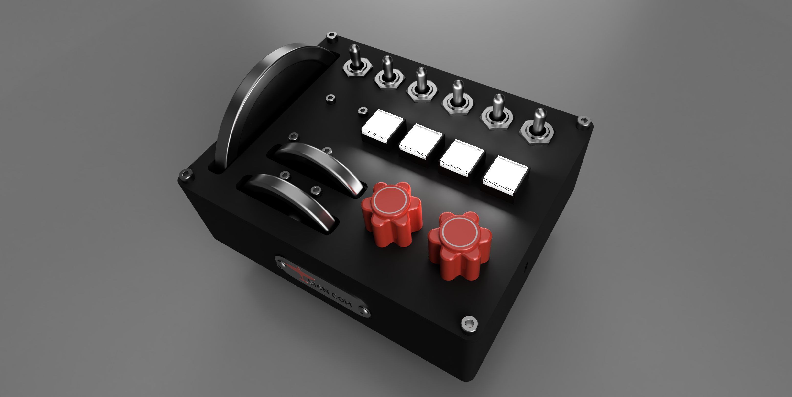
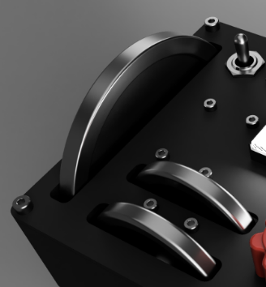
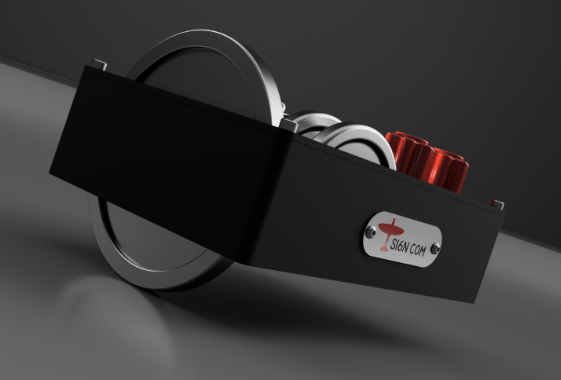
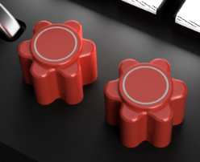
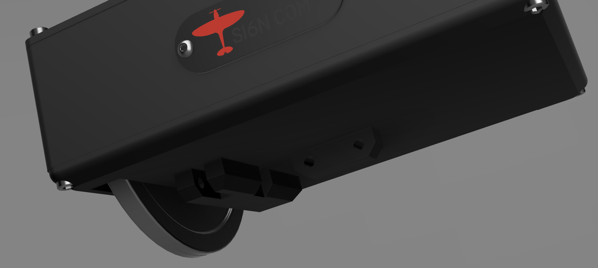

<a href="https://www.etsy.com/listing/4315608606/trim-deck"><button>BUY</button></a>

Trim Deck is a set of trim wheels with ancillary buttons and knobs for controlling fuel valves, lights, etc.

<iframe width="560" height="315" src="https://www.youtube.com/embed/a8p1j_3Wt-U?si=X5OfM-vOUT1BMG70" title="YouTube video player" frameborder="0" allow="accelerometer; autoplay; clipboard-write; encrypted-media; gyroscope; picture-in-picture; web-share" referrerpolicy="strict-origin-when-cross-origin" allowfullscreen></iframe>

# Trim Wheels

{: .center-image }

The elevator is 110mm in diameter and uses an optical encoder with 360 pulses per revolution. This provides a very smooth motion. The rudder and aileron are 64mm in diameters and use mechanical encoders with 20 detents.

The elevator wheel protrudes out of the bottom of the case.

{: .center-image }

# Fuel Tank Selection

{: .center-image }

The two red knobs are for fuel tank selection. They are 6-way rotary switches so you can map a twin engine very nicely or a single and have a spare for fuel valve, or use them for something else entirely.

Mapping tank selection can be tricky, each plane may require different mapping.  I use it on the Black Box Dukes and Blackbird 310R, Flying Iron warbirds. It takes a while to set up each plane but it's worth it. 

I have used SPAD.next to do this, per plane, and it works well. MobiFlight should also be able to manage it but I have no experience with it. I have not tried mapping directly in-game.

# Push Buttons

{: .center-image }

Four general purpose momentary push buttons, single color and constantly illuminated.  

# Toggles

{: .center-image }

Six general purpose chrome toggles (ON)-OFF-(ON). I use momentary action toggle so that the game state doesn't matter;  whether the navigation lights in the game are on or off, a push up always turns them on and push down turns them off. 

# Mounting

The size of the elevator wheel does make mounting a interesting. The housing is 136x51x170mm, the elevator wheel protrudes 30mm. 

There are four mounting options:

1. An adapter that fixes directly onto my [mounting bracket](./virpil-cdt-vmax-bracket),

2. A spacer so it can be attached to the [Virpil Desk Mount Adapter](https://virpil-controls.us.com/vpc-desk-mount-adapter-cdt-vmax-throttle.html), or sit flat on a desk

3. A base with 1/4" screw socket for 1/4" desk clamp (not included) and 4 x m3 hardpoints for you own mounting options

Flat bottom

# Software

SPAD.next or Mobiflight are needed to map fuel tanks and to alter the speed of trim adjustment.

---

*A build with custom switches replacing two of the toggles*

