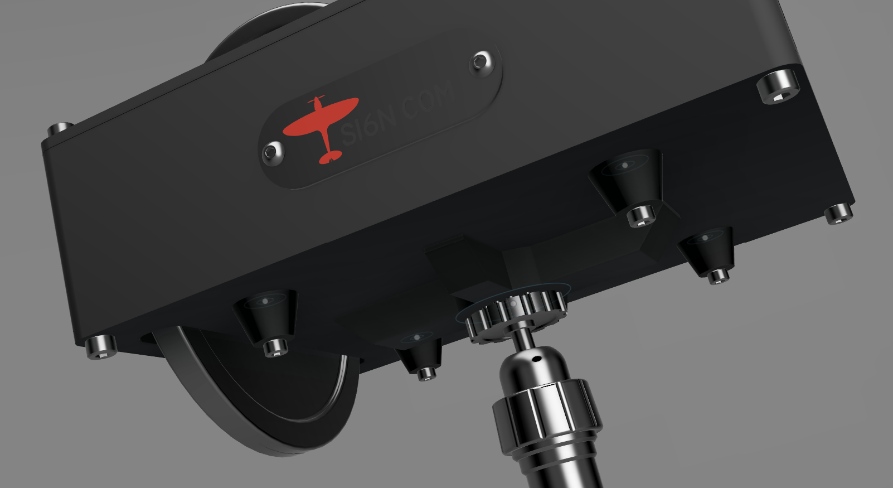

<a href="https://www.etsy.com/listing/4315608606/trim-deck"><button>BUY</button></a>

Trim Deck is a set of trim wheels with ancillary buttons and knobs for controlling fuel valves, lights, etc.

<iframe width="560" height="315" src="https://www.youtube.com/embed/a8p1j_3Wt-U?si=X5OfM-vOUT1BMG70" title="YouTube video player" frameborder="0" allow="accelerometer; autoplay; clipboard-write; encrypted-media; gyroscope; picture-in-picture; web-share" referrerpolicy="strict-origin-when-cross-origin" allowfullscreen></iframe>

# Trim Wheels

{: .center-image  .small}

The elevator is 110mm in diameter and uses an optical encoder with 360 pulses per revolution. This provides a very smooth motion. The rudder and aileron are 64mm in diameters and use mechanical encoders with 20 detents.

The elevator wheel protrudes out of the bottom of the case.

{: .center-image }

# Fuel Tank Selection

{: .center-image .small }

The two red knobs are for fuel tank selection. They are 6-way rotary switches so you can map a twin engine very nicely or a single and have a spare for fuel valve, or use them for something else entirely.

Mapping tank selection can be tricky, each plane may require different mapping.  I use it on the Black Box Dukes and Blackbird 310R, Flying Iron warbirds. It takes a while to set up each plane but it's worth it. 

I have used SPAD.next to do this, per plane, and it works well. MobiFlight should also be able to manage it but I have no experience with it. I have not tried mapping directly in-game.

# Push Buttons

{: .center-image }

Four general purpose momentary push buttons, single color and constantly illuminated.  

# Toggles

{: .center-image }

Six general purpose chrome toggles (ON)-OFF-(ON). I use momentary action toggle so that the game state doesn't matter;  whether the navigation lights in the game are on or off, a push up always turns them on and push down turns them off. 

# Software

SPAD.next is required to map fuel tanks and to alter the speed of trim adjustment. This is certainly true for MSFS if you want the rotation of the wheels to match in-game speed (as show in the video).

The elevator wheel emits 360 events per rotation and the aileron and rudder wheels emit 20 events per rotation.  Other software (e.g. Mobiflight, Axis and Ohs) that allows mapping of device events to SIMCONNECT data values should also work and games that have built-in functionality to make external trim wheels work effectively should too.  **As I haven't personally tested these alternatives I cannot attest to their effectiveness.**

These table shows the SIMCONNECT events and values I use in SPAD.next. 

## Trim

The size of the increment/decrement can be adjusted to taste and/or to aircraft. Some aircraft have built-in trim sensitivity adjustments that may also be helpful.

| Trim Wheel | SIMCONNECT data value  | Increment/Decrement by |
| ---------- | ---------------------- | ---------------------- |
| Elevator   | ELEVATOR TRIM POSITION | 0.001                  |
| Aileron    | AILERON TRIM PCT       | 0.025                  |
| Rudder     | RUDDER TRIM PCT        | 0.025                  |

## Fuel

This is rough guidance, each aircraft may have specific requirements and LVAR, for example the MilViz 310R has 4 positions, left and right valves and uses only LVAR. Others may use SIMCONNECT events or a combination. It can take some time to figure this out, the better aircraft cover this in their documentation. 

Note: for the twins the numbers are reversed left vs. right to match the counter rotation of the physical knobs.

### Default

On each button press, two Actions must be performed:

| Position | SIMCONNECT:FUEL_SELECTOR_SET | LVAR:FUEL_SELECTOR |
| -------- | ---------------------------- | ------------------ |
| 1        | 5                            | 5                  |
| 2        | 4                            | 4                  |
| 3        | 3                            | 3                  |
| 4        | 2                            | 2                  |
| 5        | 1                            | 1                  |
| 6        | 0                            | 0                  |

Combined the two action so, it will look like this in the UI

### MilViz 310R

A twin.

| Position | LVAR:C310_SW_FUEL_SEL_LEFT | LVAR:C310_SW_FUEL_SEL_RIGHT |
| -------- | -------------------------- | --------------------------- |
| 1        | 3                          | 0                           |
| 2        | 2                          | 1                           |
| 3        | 1                          | 2                           |
| 4        | 0                          | 3                           |

Use per aircraft profiles, alternatively a condition may be used to filter the actions:

### Black Square Duke

Another twin.

| Position | SIMCONNECT:FUEL_SELECTOR_SET | SIMCONNECT:FUEL_SELECTOR_2_SET |
| -------- | ---------------------------- | ------------------------------ |
| 1        | 0                            | 20                             |
| 2        | 19                           | 19                             |
| 3        | 20                           | 0                              |

### Flying Iron BF109

| Position | LVAR:FuelValveSelected |
| -------- | ---------------------- |
| 1        | 3                      |
| 2        | 2                      |
| 3        | 1                      |
| 4        | 0                      |

# Mounting

The size of the elevator wheel does make mounting slightly challenging. The housing is 136x51x170mm, the elevator wheel protrudes 30mm. 

There are four mounting options:

1. An adapter that fixes directly onto my [mounting bracket](./virpil-cdt-vmax-bracket-v2),

2. A spacer so it can be attached to the [Virpil Desk Mount Adapter](https://virpil-controls.us.com/vpc-desk-mount-adapter-cdt-vmax-throttle.html), or sit flat on a desk

3. A base with 1/4" screw socket for 1/4" desk clamp (not included) and 4 x m3 hardpoints for you own mounting options

Flat bottom

close-up of customer build with black/gold colorway

*A build with custom switches replacing two of the toggles*

