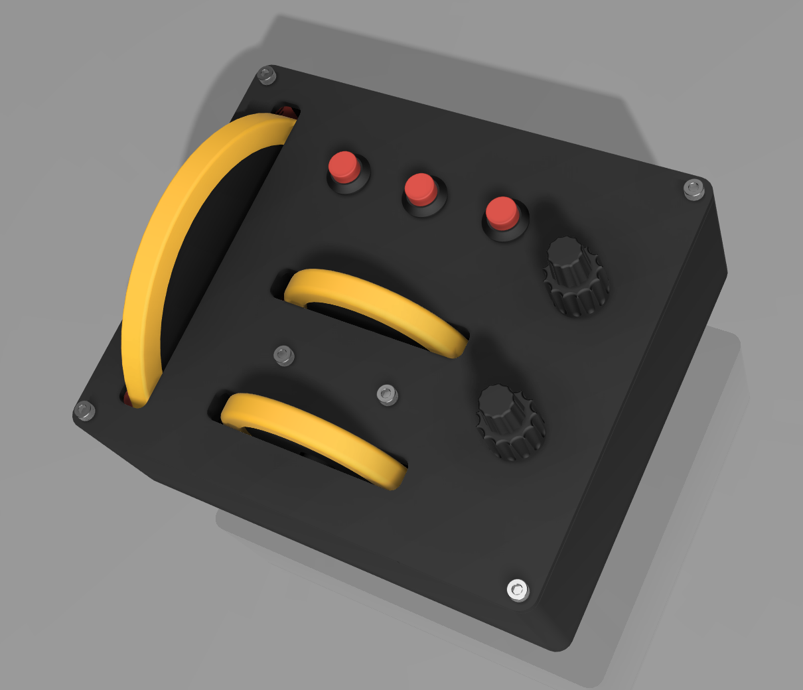
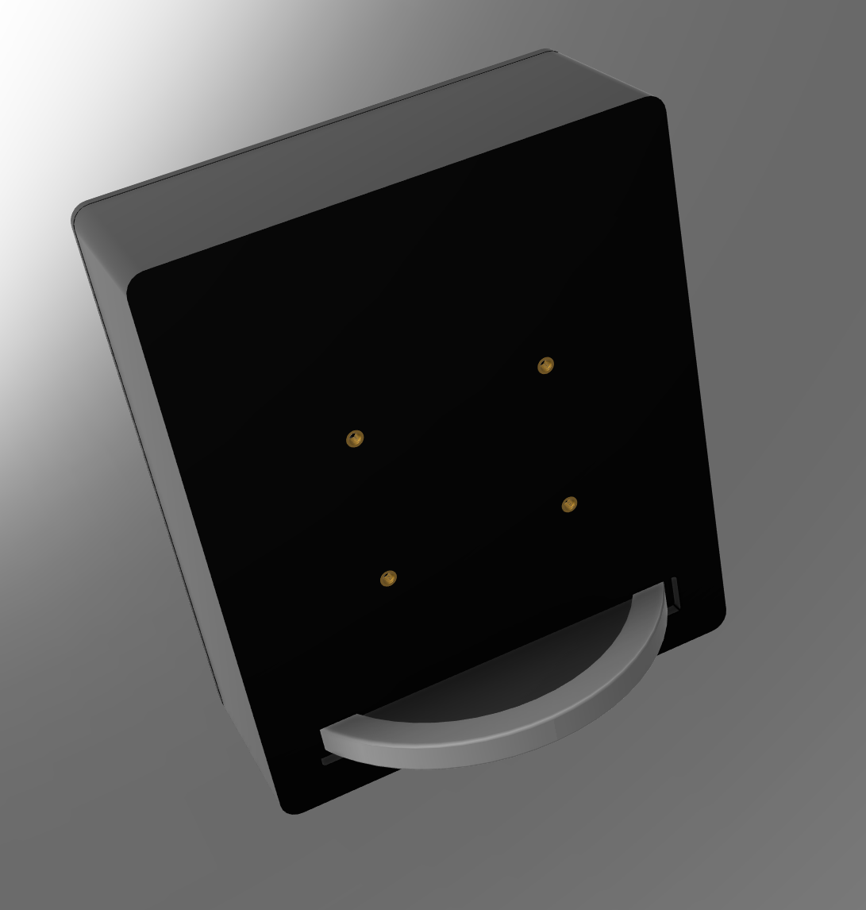
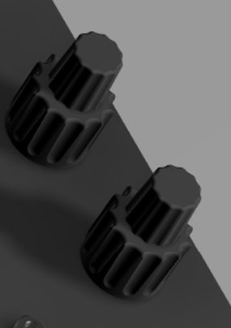
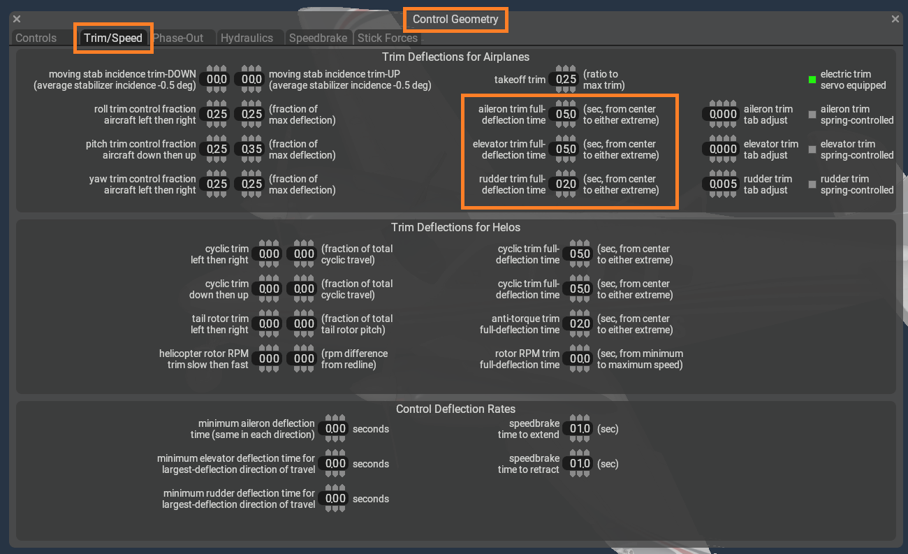
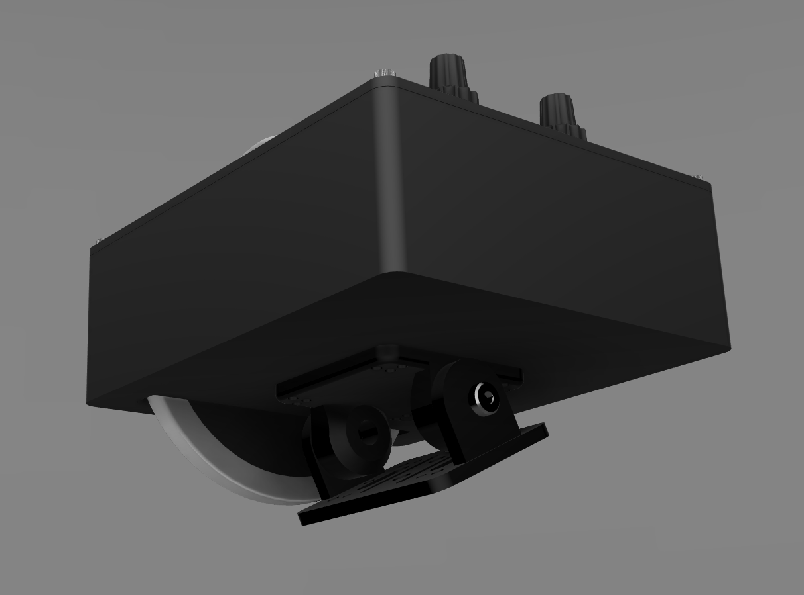

<a href="https://s16nengineering.etsy.com"><button>BUY</button></a>

Trim Deck is a set of trim wheels for elevator, aileron, rudder plus dual encoders for controlling trim reset, auto-trim or something else. Each wheel has a friction damper; they will not freewheel or move of their own free-will.

# Trim Wheels

The elevator is 110mm in diameter, the rudder and aileron are 62mm in diameter. All the wheels use magnetic sensors providing very smooth motion. 

The trim wheels emit button presses and are also mapped to separate axis. 

The wheels protrude from the bottom of the case.

# Encoders

Two general purpose dual encoders are available for mapping.

# Mapping

The trim wheels can be mapped using button presses or axis, each has advantages and disadvantages. The best option depends on the simulators and desired functionality.

### Buttons

Mapping with button presses cannot desynchronize from the simulation, as the position of the trim wheel is always relative to the trim position in the simulator. The limitation is how the sim interprets each of the button presses, even between aircraft. MSFS generally doesn't do this well and trim movement will most likely be very slow because it's expecting the button to be _held_. To mitigate this, it is recommended to use some software such as SPAD.next which will allows the trim sensitivity to be adjusted precisely to your needs, per aircraft is needed. This can be done directly in X-Plane 12 using the Plane Maker.

### Axis

Mapping using axis is straight forward. One rotation equals one axis cycle. The downside is the axis position can become desynchronized from the simulation causing sudden jumps when the axis is moved, either physically or in the simulation. This can happen any time the trim wheel or trim in the simulation are moved independently of each other. For example at the start of a flight there will be mismatch between the physical position and where the simulation thinks the trim wheel is, so the first time you touch the physical wheel the trim will jump to the wheel position. It can also happen if AP adjusts the trim too. This can be mitigated by always centering the wheel at the start of a flight, during a flight it is a little trickier. 

## Software

### X-Plane 12

Use Plane Maker to adjust the trim sensitivity in Control Geometry.

### SPAD.next

SPAD.next is can be used to alter the speed of trim adjustment when mapping using button presses. This is certainly true for MSFS if you want the rotation of the wheels to match in-game speed (as show in the video).

The wheel emits 100 events per rotation.  Other software (e.g. Mobiflight, Axis and Ohs) that allow the mapping of device events to SIMCONNECT data values should also work and games that have built-in functionality to make external trim wheels work effectively should too.  **As I haven't personally tested these alternatives I cannot attest to their effectiveness.**

These table shows the SIMCONNECT events and values I use in SPAD.next. 

#### Settings

The size of the increment/decrement can be adjusted to taste and/or to aircraft. Some aircraft have built-in trim sensitivity adjustments that may also be helpful. These are starting points:

| Trim Wheel | SIMCONNECT data value  | Increment/Decrement by |
| ---------- | ---------------------- | ---------------------- |
| Elevator   | ELEVATOR TRIM POSITION | 0.004                  |
| Aileron    | AILERON TRIM PCT       | 0.01                   |
| Rudder     | RUDDER TRIM PCT        | 0.01                   |

#### Black Square Starship

The Starship seems to work better with a larger elevator increment of 0.02

### Simtrim 

https://flightsim.to/file/83514/simtrim-synchronising-your-analog-elevator-trim-wheel

# Mounting

The size of the wheels does make mounting slightly challenging. The housing is approximately 153x131x52mm, the elevator wheel protrudes ~30mm. 

If you have an idea for a custom mount, get in touch and I will try to accommodate you.

# Photos

A close-up of a customer build of the Trim Deck with black/gold colorway. Custom colors on request.

