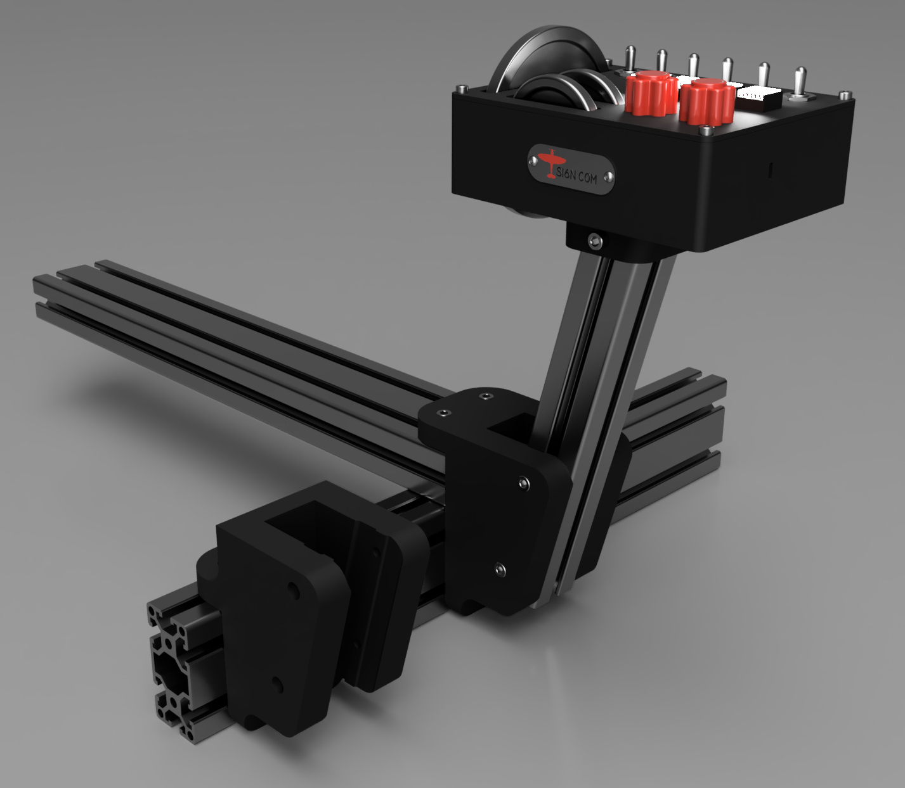
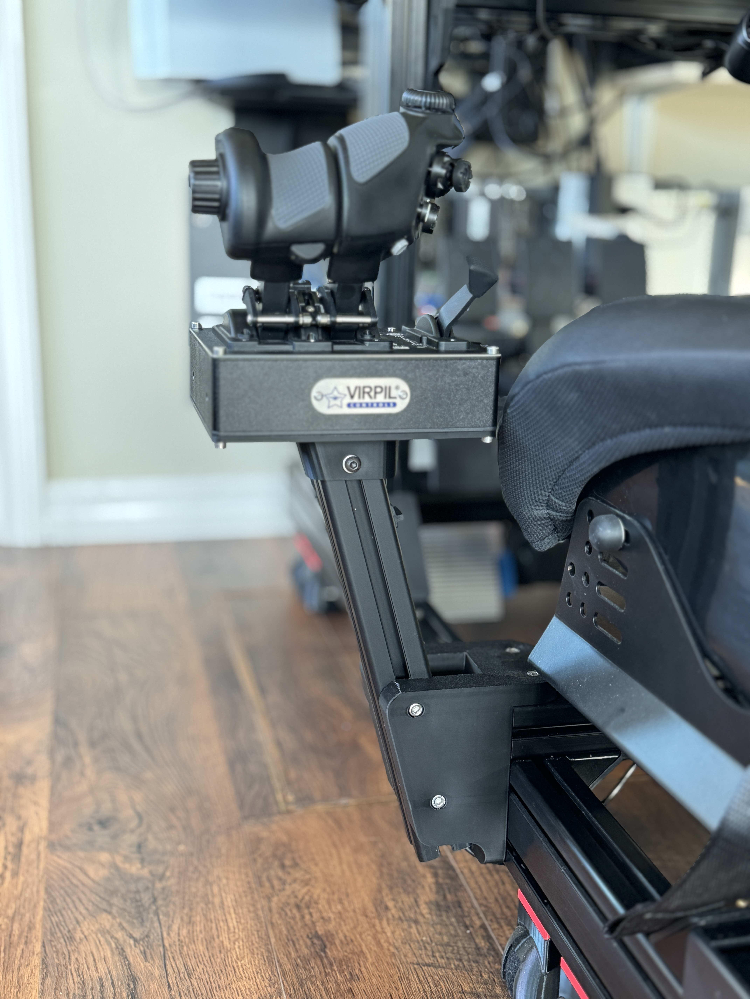
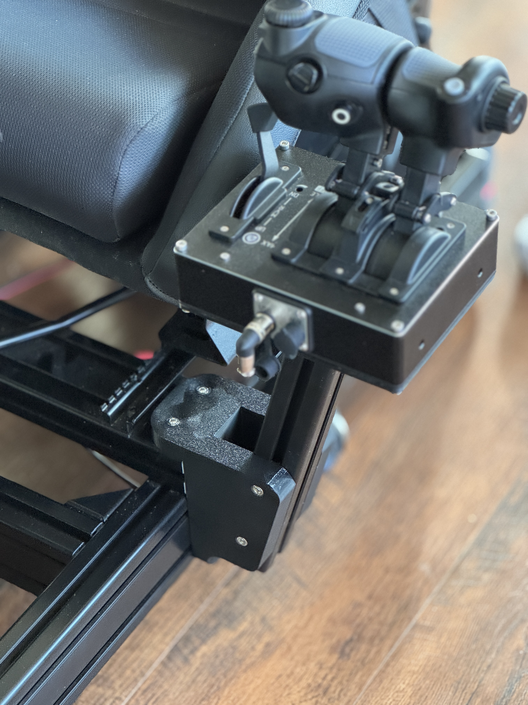

- For 40-series profile

- Height adjustable a few centimeters up and down

- Prints with no support. 

- Print with strength profile. 5 or 6 walls. PLA is fine.

- Two lower brackets included, depending on rig attachment point

- Download on [Printables](https://www.printables.com/model/1309679-virpil-cdt-vmax-profile-bracket)

-  [Old version](virpil-cdt-vmax-bracket-v1.md) 

  

## Parts needed

- 4 x M6 profile nuts
- 2 x M6 15mm hex socket bolts
- 4 x M6 20mm hex socket bolts 
- 4 x M6 25mm hex socket bolts 
- 4040 profile - I used 280mm

