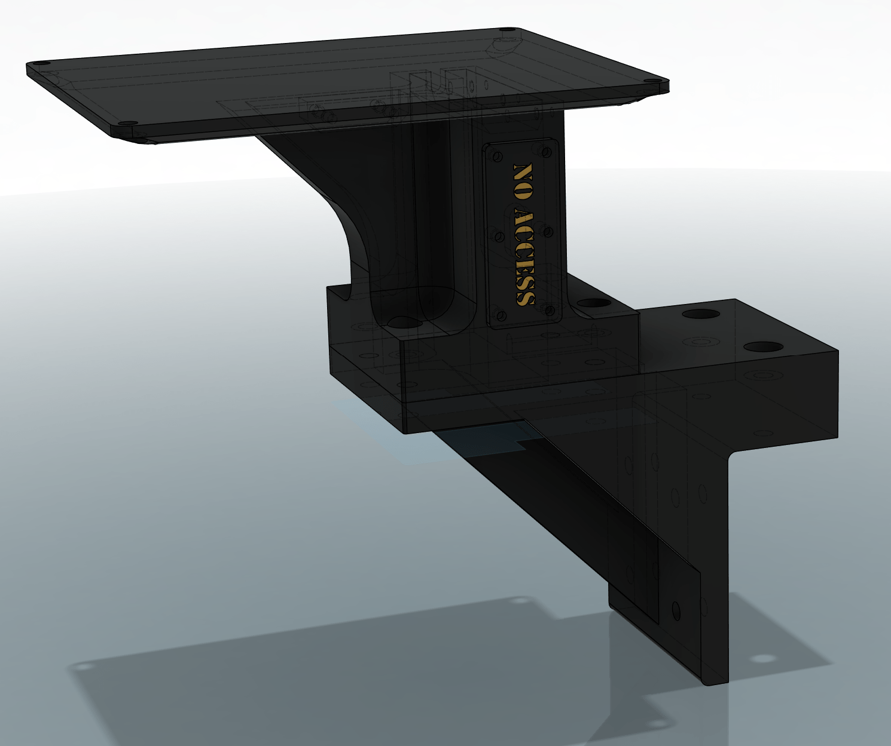

{: .center-image .small-image }

- Bolts together, needs no support. Print with 5 or 6 walls. Infill 15%. PLA is fine.
- Unbolt the bottom plate on the throttle, reuse the same bolts to attach it to the bracket (leave the bottom plate on) 
- It has a channel for the USB cable
- It was built to use what I had on hand. Easily modifiable to use straight through nuts and bolts instead of heatset nuts and it could also be tweaked to use on M6 30mm.
- The NO ACCESS hatch is there to cover an accessory mount point, I had a touchpad platform attached at one point. It could be blanked off completely.

## STEP

[Printables](https://www.printables.com/model/1309679-virpil-cdt-vmax-profile-bracket)

{: .center-image .small-image }

## Parts needed

- 11 x M3 10mm bolts with heatset nuts
- 4 x M6 profile nuts
- 4 x M6 30mm hex socket bolts to join the main bracket assemblies
- 2 x M6 30mm hex socket bolts to attach to rig
- 2 x M6 20mm hex socket bolts to attach to rig 

